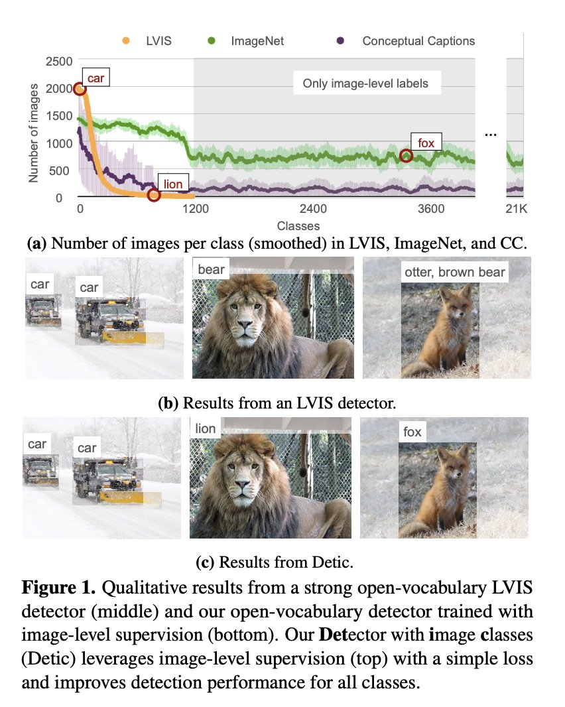

# detic-detecting-20k-classes-using-image-level-supervision

## Overview

- Original paper: https://arxiv.org/abs/2201.02605
- Official GitHub: https://github.com/facebookresearch/Detic

Detic provides a gain of `2.4` mAP for all classes and `8.3` mAP for novel classes on the open-vocabulary LVIS benchmark



## Features
- Detects any class given class names (using CLIP).
- We train the detector on ImageNet-21K dataset with 21K classes.
- Cross-dataset generalization to OpenImages and Objects365 without finetuning.
- State-of-the-art results on Open-vocabulary LVIS and Open-vocabulary COCO.
- Works for DETR-style detectors.

## Demo

Click here to run a demo

[](https://studiolab.sagemaker.aws/import/github/machinelearnear/detic-detecting-20k-classes-using-image-level-supervision/blob/main/detic_demo.ipynb)

## References

```bibtext
@inproceedings{zhou2021detecting,
  title={Detecting Twenty-thousand Classes using Image-level Supervision},
  author={Zhou, Xingyi and Girdhar, Rohit and Joulin, Armand and Kr{\"a}henb{\"u}hl, Philipp and Misra, Ishan},
  booktitle={arXiv preprint arXiv:2201.02605},
  year={2021}
}
```